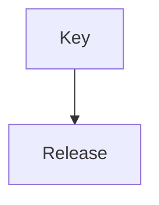

[[key]] can be [[Pressable]] (== [[Pressed]])
[[key]] can be [[Releasable]] (== [[Released]])

# state allows actions
[[Pressed]] is state
# action gives states
[[Pressable]] is action

```mermaid
graph TD
Key --> Release
```